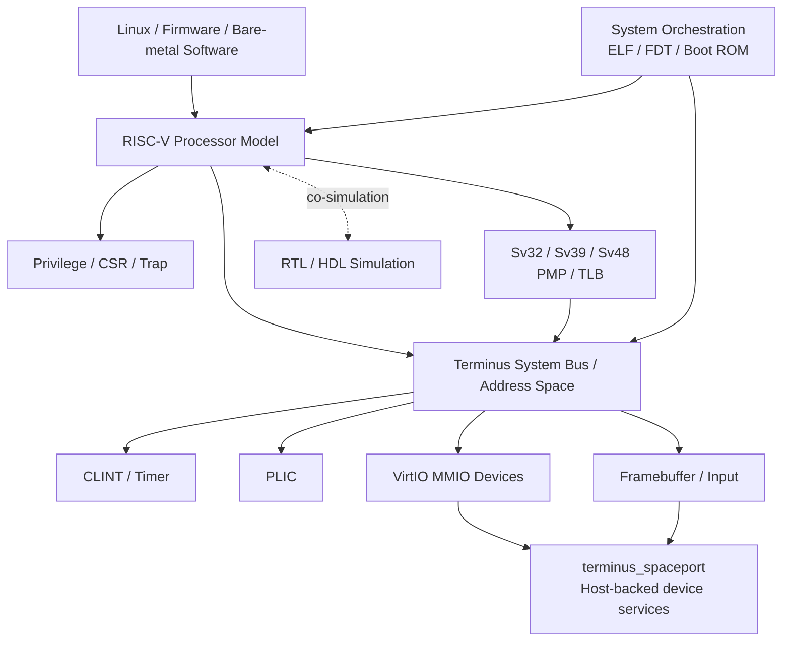

# terminus

A **RISC-V instruction-set and system simulator written in Rust**. Terminus models enough of a RISC-V platform to boot Linux, run multicore workloads, exercise privileged architecture and virtual memory, emulate common platform devices, and integrate with RTL co-simulation environments.

Terminus currently supports:

- RV32 / RV64
- I + M / A / F / D / C extensions
- M / S / U privilege modes
- Sv32 / Sv39 / Sv48 virtual memory
- PMP, page-table walking, and separate fetch/load/store TLBs
- CLINT and PLIC interrupt controllers
- Multicore systems and SMP Linux
- Generated FDT and boot ROM
- VirtIO console, block, network, keyboard, and mouse devices
- Framebuffer/display support
- HDL co-simulation
- GDB remote debugging

It is also used as the architectural-model side of the [`terminus_cosim`](https://github.com/shady831213/terminus_cosim) verification environment.

---

## Why terminus?

Terminus started as an ISA simulator and gradually grew into a small executable RISC-V system model.

The project is most useful for problems that cross several layers at once:

**ISA / privileged architecture → MMU → interrupts → platform devices → firmware → operating system → RTL verification**

Rather than modelling instructions in isolation, Terminus includes enough architectural and platform behavior to execute real system software. Its MMU path, for example, models page-table walking, PTE permission checks, PMP, TLBs, access/page faults, A/D handling, and privileged-state behavior such as `MPRV`, `MXR`, and `SUM`.

---

## Architecture



The top-level crate exposes reusable `processor`, `devices`, `system`, and `gdb` modules. `System` is responsible for processor construction, the address map, memory/device registration, FDT generation, ELF loading, and boot-ROM/reset setup. The standalone CLI composes those pieces into a Linux-capable platform with VirtIO and optional display/networking support.

---

## ISA and privileged architecture

- RV32 / RV64
- I + M / A / F / D / C extensions
- M / S / U privilege modes
- RISC-V trap and exception handling
- Sv32 / Sv39 / Sv48 virtual memory
- PMP
  - TOR
  - NA4
  - NAPOT
- page-table walking
- PTE permission checks
- `MPRV`, `MXR`, and `SUM`
- Accessed / Dirty bit handling
- separate instruction / load / store TLBs
- TLB invalidation

---

## Boot Linux

```bash
git clone https://github.com/shady831213/terminus
cd terminus

cargo update -p terminus-spaceport
cargo update -p terminus-vault
cargo install --path .

terminus examples/linux/image/br-5-4
```

A disk-backed root filesystem can also be used:

```bash
cd examples/linux/image
tar -zxvf rootfs.ext4.gz
cd -

terminus \
  examples/linux/image/br-5-4.disk \
  --image=examples/linux/image/rootfs.ext4
```


---

## Multicore Linux

Use `-p` to configure the number of simulated RISC-V HARTs:

```bash
terminus examples/linux/image/br-5-4 -p 4
```

Inside Linux:

```text
# cat /proc/cpuinfo

processor : 0
hart      : 0
mmu       : sv48

processor : 1
hart      : 1
mmu       : sv48

processor : 2
hart      : 2
mmu       : sv48

processor : 3
hart      : 3
mmu       : sv48
```

---

## Interrupts, boot flow, and platform description

The system model includes:

- CLINT / timer
- PLIC
- HTIF console support
- ELF loading
- generated Flattened Device Tree (FDT)
- generated boot ROM and reset vector
- per-HART interrupt wiring
- VirtIO MMIO registration and FDT description

This allows the simulated machine description to be generated from the configured processors and devices rather than relying on a fixed external DTB.

---

## VirtIO and host-backed devices

The standalone `terminus` binary can compose the system with:

- VirtIO console
- VirtIO block device
- VirtIO network device
- VirtIO keyboard
- VirtIO mouse
- simple framebuffer

The shared device and host-service infrastructure is provided through [`terminus_spaceport`](https://github.com/shady831213/terminus_spaceport), while Terminus owns the processor/system integration and platform construction.

---

## Networking

Run the helper script to create a TAP interface and bridge:

```bash
./setup_tuntap.sh
```

Then start the guest with a VirtIO network device:

```bash
terminus \
  examples/linux/image/br-5-4.disk \
  --image=examples/linux/image/rootfs.ext4 \
  --net=tap0
```

After configuring the guest interface, the simulated machine can communicate through the host network.

---

## Display

Display support uses SDL2.

On Ubuntu:

```bash
sudo apt-get install libsdl2-dev
```

Build with display support:

```bash
cargo install --features="sdl" --path .
```

Run:

```bash
terminus \
  examples/linux/image/br-5-4.disk \
  --image=examples/linux/image/rootfs.ext4 \
  --boot_args="root=/dev/vda console=tty0 earlycon=sbi" \
  --display
```

---

## RTL / HDL co-simulation

One of the main uses of Terminus is integration with RTL verification.

See [`terminus_cosim`](https://github.com/shady831213/terminus_cosim), which connects Terminus with RTL CPU cores, firmware testcases, SystemVerilog/DPI, and host-side verification infrastructure.

```text
                 Firmware / Testcase
                         |
                         v
              +-----------------------+
              | Terminus ISA / System |
              |        Model          |
              +-----------+-----------+
                          |
                   architectural
                    interaction
                          |
              +-----------v-----------+
              |      RTL CPU/Core     |
              |    HDL Simulator      |
              +-----------+-----------+
                          |
                         DPI
                          |
              +-----------v-----------+
              |  vhost / mailbox_rs   |
              | Host Verification Env |
              +-----------------------+
```

Related projects:

- [`terminus_cosim`](https://github.com/shady831213/terminus_cosim) — ISA/RTL co-simulation environment
- [`vfw_rs`](https://github.com/shady831213/vfw_rs) — Rust firmware infrastructure for verification
- [`vhost`](https://github.com/shady831213/vhost) — host-side co-simulation and verification infrastructure
- [`mailbox_rs`](https://github.com/shady831213/mailbox_rs) — host/target communication infrastructure

---

## GDB remote debugging

Terminus supports GDB remote debugging through `--gdb-port`:

```bash
terminus examples/linux/image/br-5-4 --gdb-port 1234
```

Connect from another terminal:

```bash
riscv64-unknown-elf-gdb
```

```gdb
target remote localhost:1234
info registers
x/4i $pc
stepi
break *0x80000000
continue
```

Current restrictions:

- RV64 only
- single-core only
- software breakpoints

The GDB support was implemented by [`oh-my-openagent`](https://github.com/code-yeongyu/oh-my-openagent).

---

## Feature status

| Feature | Status |
| --- | --- |
| RV32 / RV64 | ✅ |
| I | ✅ |
| M | ✅ |
| A | ✅ |
| F | ✅ |
| D | ✅ |
| C | ✅ |
| M / S / U privilege modes | ✅ |
| Sv32 | ✅ |
| Sv39 | ✅ |
| Sv48 | ✅ |
| PMP | ✅ |
| RISC-V ISA tests | ✅ |
| CLINT / Timer | ✅ |
| PLIC | ✅ |
| FDT generation | ✅ |
| Multicore | ✅ |
| Linux boot | ✅ |
| SMP Linux | ✅ |
| VirtIO console | ✅ |
| VirtIO block | ✅ |
| VirtIO network | ✅ |
| Framebuffer | ✅ |
| VirtIO keyboard / mouse | ✅ |
| HDL co-simulation | ✅ |
| GDB remote debugging | ✅ |
| B extension | planned |
| V extension | planned |

---

## Project layout

```text
src/
├── processor/
│   ├── extensions/      ISA extensions
│   ├── privilege/       privileged architecture / CSRs
│   ├── mmu/             Sv32/Sv39/Sv48, PMP, PTEs and TLBs
│   ├── fetcher.rs
│   ├── load_store.rs
│   └── trap.rs
├── devices/             bus, CLINT, PLIC and HTIF integration
├── system/              ELF, FDT, memory map and platform orchestration
├── gdb/                 GDB remote debugging
└── bin/terminus.rs      standalone Linux-capable system composition
```

---

## Rust version

Terminus currently requires:

```text
Rust >= 1.56
edition = 2021
```

The older Rust 2018 version is kept on the `edition2018` branch.

---

## Project direction

Areas of continued interest include:

- additional RISC-V ISA extensions
- architectural-model improvements
- debugging and observability
- RTL/ISA co-simulation
- firmware-driven verification
- better integration between executable architecture models and hardware verification infrastructure

Terminus is primarily a project for exploring **computer architecture, systems, and hardware/software verification through executable models**.

---

## License

See [LICENSE](LICENSE).
